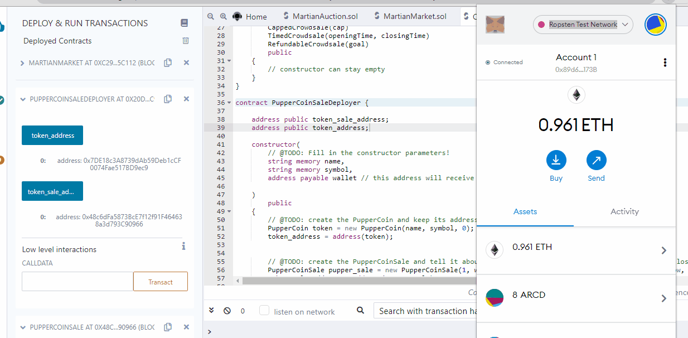
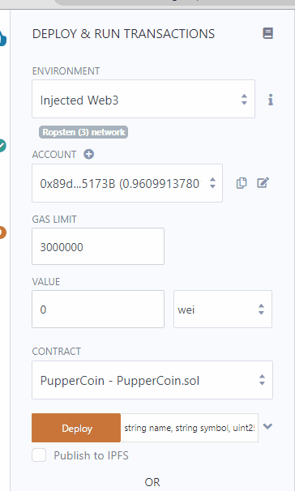
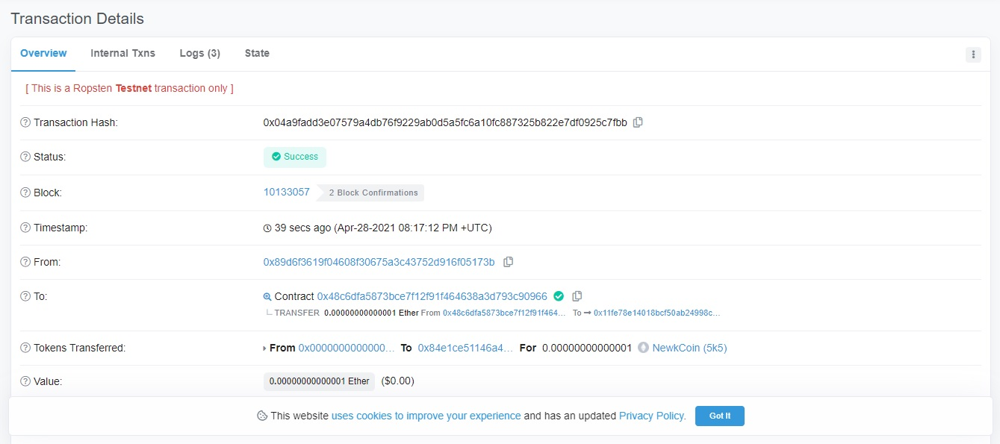
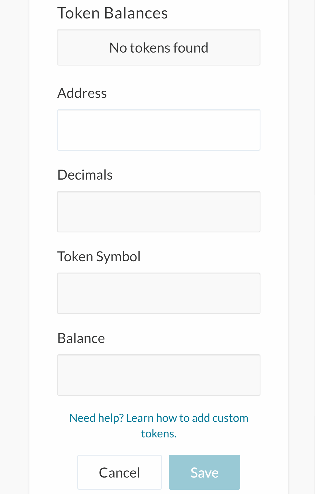
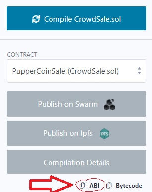
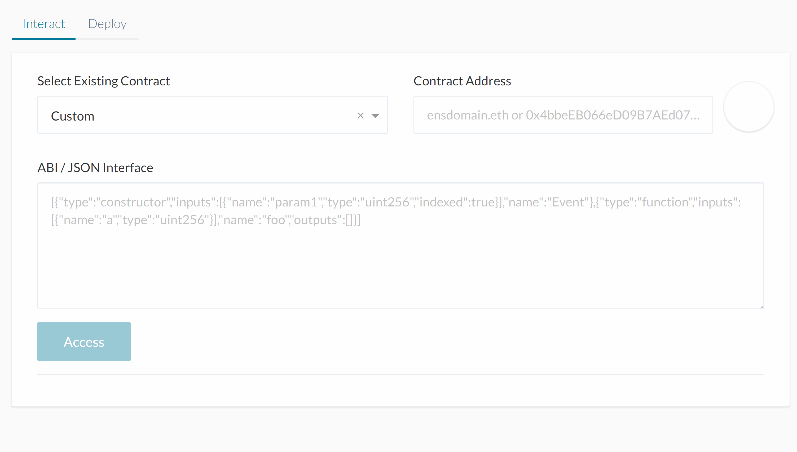

# Advanced-Solidity-Homework

## Matt Newkirk
### UW FinTech April 2021

For this homework we were tasked with deploying a token crowdsale using the ethereum blockchain. The Remix Solidity IDE was used for completing the provided starter code .sol files. Once completed to specifications, the CrowdSale.sol was then deployed to a local Ganache based blockchain and tested using the MyCrypto wallet, MetaMask, as well as Remix's inherent contract interaction functionality. This process was then repeated using the Ropsten test network.

## Deployment

Deploying the PupperCoinSaleDeployer contract from CrowdSale.sol will also deploy PupperCoinSale and PupperCoin contracts on the specified test network. MetaMask is used to handle this transaction. Then those two dependant deployed contracts are added into Remix such that we can use their funcation calls. This is done by accessing the deployed contract addresses from PupperCoinSaleDeployer and then adding those contracts to Remix by deploying the relevant contract from the specified address. Now that that is done we can use Remix to buyTokens.

## Adding the created token to MetaMask

Now, let's add the created token to our index of custom tokens within MetaMask. Copy the address of the deployed token contract and then add it to MetaMask by using the 'Add Token' button on the mainpage.

## Buying tokens in Remix

Now let's use Remix to try buying some tokens. Just open up PupperCoinSale in the list of deployed contracts, find the buyTokens functions, and simply paste the address of the account you are buying tokens for. Be sure to set the amount of Ether you are sending to buyTokens in the relevant section of Remix's deployment controls. Use MetaMask to complete the transaction. After transaction completion, we can check out the details over on EtherScan. The transaction fee in this case was just .00035145 ether.

## Buying tokens in MyCrypto

Open MyCrypto, ensure that you are connected to whichever testnetwork you deployed the contract on. Unlock a wallet, and the add the created token using the Add Token tool and once again pasting the deployed token address. To buy tokens within MyCrypto, click the Contracts menu option over in the left menu bar, specify the address of the deployed PupperCoinSale contract, paste the ABI for the contract into the ABI field, and select the buyTokens function from Read / Write Contract box. Now just specify the beneficiary address that will receive the tokens, and then finally unlock a wallet to use for sending the ether to buy the tokens and tranascting with the contract.

